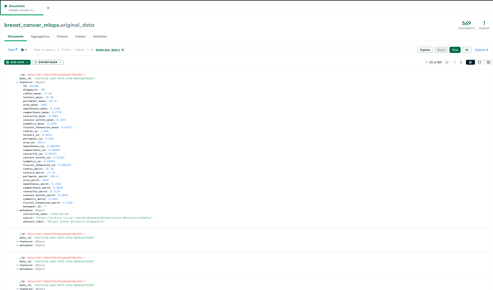
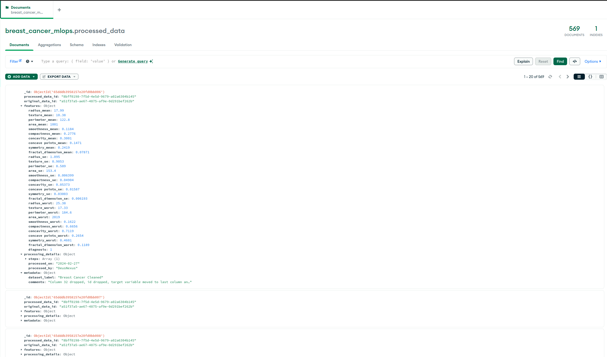

## Scripts
1. Contains script files to connect to the MongoDB database which is used as central repository and used for data versioning
2. Script to write original / raw data with metadata to central data repository using the `insert_original_document` method from `database.py`
    - The current dataset.csv is loaded into a Pandas DataFrame, a unique `data_id` is generated using `uuid4` and used for the entire dataset collection.
    - Each insert statement contains a row of the dataframe using the following method parameters: 
        - db: The database connection.
        - data_id (str): Unique identifier for the data.
        - features (dict): Feature values of the data.
        - collection_date (str): Date when the data was collected.
        - source (str): Source of the data.
        - dataset_label (str): Label identifying the dataset.
    - Example:
    ``` 
    insert_original_document(
        db, 
        data_id='12345', 
        features={}, 
        collection_date='2024-02-25', 
        source='Hospital XYZ', 
        dataset_label='Breast_Cancer_Study_2024'
    ) 
    ```
3. Script to write processed data, e.g. when the dataframe is cleaned and keep record of what has changed using the `write_processed_data.py` method from `database.py`
    - In this case the current dataset.csv is also loaded from local file, however ideally this should be loaded from the central database using the orignal / raw data.
    - For practicability (not needing to setup database for running the notebooks and changing data_id's etc.) this is just done in 'theory'.
    - The processed data is still written to the database using metadata attributes for data versioning and tracking using the following method parameters:
        - db: The database connection.
        - processed_data_id (str): Unique identifier for the processed data.
        - original_data_id (str): Identifier linking back to the original raw data.
        - features (dict): Processed feature values.
        - steps (list): List of processing steps applied to the data.
        - processed_on (str): Date when the data was processed.
        - processed_by (str): Identifier of the person or system that processed the data.
        - dataset_label (str): Label identifying the processed dataset.
        - comments (str): Additional comments regarding the processing.
    - Example:
    ```
    insert_processed_document(
        db, 
        processed_data_id='67890', 
        original_data_id='12345', 
        features={}, 
        steps=["scaled", "encoded"], 
        processed_on="2024-03-01", 
        processed_by="DataEngineerA", 
        collection_date='2024-02-25', 
        dataset_label='Breast_Cancer_Study_2024_Processed', 
        comments='Data scaled and encoded for model input.'
    )
    ```

## MongoDB Compass
The MongoDB Compass can be used as GUI to view the inserted data, as seen in the example images.

**Database Collections of the Breast Cancer Project**


**Original Datasets (unprocessed entries)**


**Processed Datasets (any altered data)**
